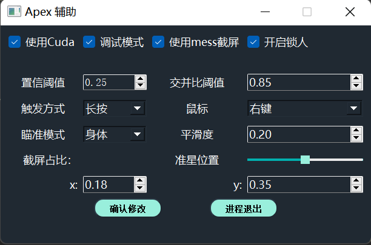
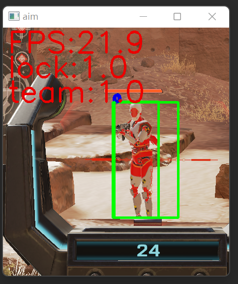
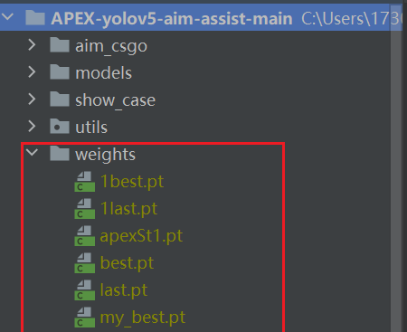

# APEX-yolov5-aim-assist-main

## apex 辅助瞄准工具
### 声明
  - 代码仅限于学习yolov用途，杜绝游戏作弊，从你我做起。
  - 原作者的想法传达下：想开游戏自瞄的别来这里搞作弊。
  - 该仓库实现的功能，不会到达理想的作弊效果（优化作弊效果的代码不会上传）。
  

## TODO

- 录制视频教程
- 改进鼠标移动体验
- 打包发布

## Show Case

* **控制面板**

* **识别效果**

* **游戏内截图**

## 模型训练代码仓库
基于yolov5的release 5.0版本 [https://github.com/brillian32/apex_yolov5_train](https://github.com/brillian32/apex_yolov5_train)

### 仓库中的权重文件已被删除，可联系我获取

----------------------------------
## 支持

[https://github.com/ultralytics/yolov5](https://github.com/ultralytics/yolov5)

[https://github.com/davidhoung2/APEX-yolov5-aim-assist](https://github.com/davidhoung2/APEX-yolov5-aim-assist)
